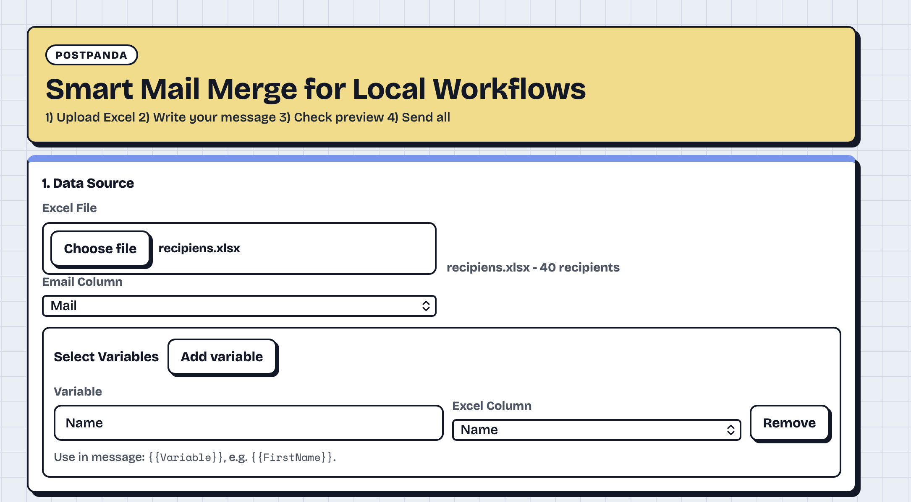

# PostPanda

PostPanda exists to make small email campaigns from Excel fast and local.
Since Mail Merge in Word doesn't work reliably on Mac with Excel, I vibe coded this little tool.
You can write one template, preview each recipient, and send everything without copying text by hand.

## Screenshot:



## What It Does

- Upload an Excel file (`.xlsx`, `.xls`)
- Pick the email column
- Use placeholders like `{{FirstName}}`
- Preview per recipient before sending
- Send with SMTP password/app password
- Send with OAuth (Microsoft/Google)
- Send in mail app draft mode (no password)

## Quick Start

1. Install dependencies:

```bash
python3 -m pip install -r requirements.txt
npm run install:frontend
```

2. Start app:

```bash
npm run dev
```

3. Open:

- Frontend: `http://localhost:5173`
- Backend health: `http://localhost:8000/api/health`

## OAuth Setup (Optional)

1. Copy `.env.example` to `.env`
2. Fill OAuth keys:

- `MS_CLIENT_ID`
- `MS_CLIENT_SECRET`
- `MS_TENANT_ID` (optional)
- `GOOGLE_CLIENT_ID`
- `GOOGLE_CLIENT_SECRET`

3. Add redirect URIs in provider apps:

- `http://localhost:8000/api/oauth/callback/microsoft`
- `http://localhost:8000/api/oauth/callback/google`

4. Restart `npm run dev`

## Notes

- OAuth tokens are kept in memory only (local runtime), not persisted to disk.
- `.env.example` contains placeholders only, no real secrets.
